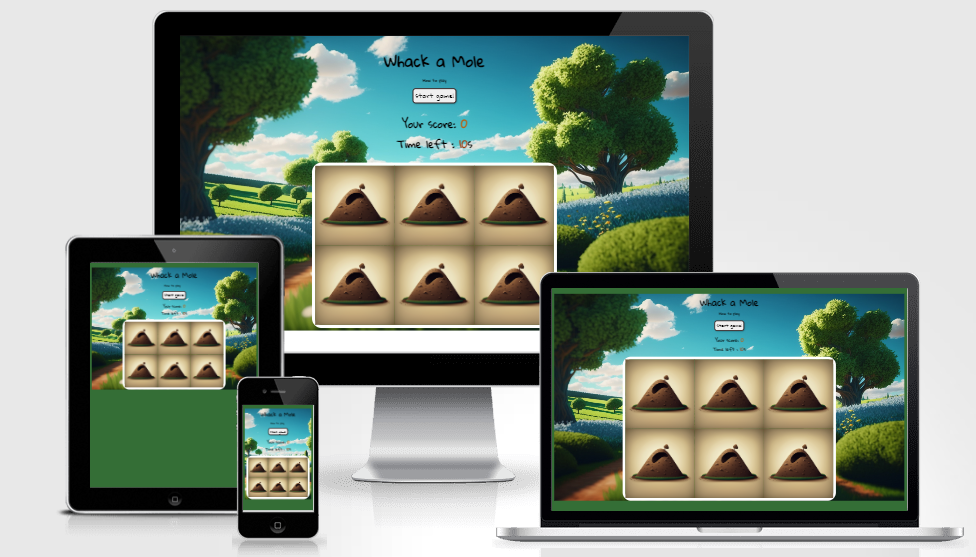
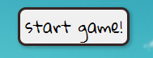

#  Whack a Mole 

### Whack a mole is a game in which players have 10 seconds to hit as many moles as possible.Players must react quickly and have good hand-eye coordination to succeed in this  game.

## *[Live site](https://karoskodev.github.io/Whack-a-Mole/)*
## *[Repository](https://github.com/Karoskodev/Whack-a-Mole)*

## contents

1. [ UX ](#ux)
2. [ Features ](#features)  
3. [ Technology used ](#technology)
4. [ Testing ](#testing)
5. [ Deployment](#deployment)
6. [ Credits](#credits)
7. [ Acknowledgements](#acknowledgements)

 

## UX
### Site Goals
Whack-a-Mole game has been designed to be fun and engaging for players of all ages and skill levels.
The game has been designed to be visually appealing and the screen is optimized for different screen sizes and resolutions, ensuring that it looks great on both desktop and mobile devices.

### Page Wireframe

  

## Features

### Start Button
 The game includes a "Start" button that users can click to begin playing the game, providing a clear and easy way to initiate the game.

 

 
Start button hovered on it:
 

