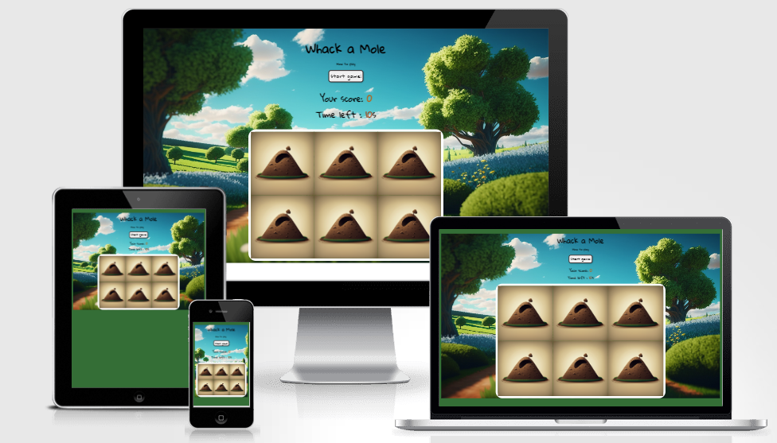

#  Whack a Mole 

### Whack a mole is a game in which players have 10 seconds to hit as many moles as possible.Players must react quickly and have good hand-eye coordination to succeed in this  game.

## *[Live site](https://karoskodev.github.io/Whack-a-Mole/)*
## *[Repository](https://github.com/Karoskodev/Whack-a-Mole)*

## contents

1. [ UX ](#ux)
2. [ Features ](#features)  
3. [ Technology used ](#technology)
4. [ Testing ](#testing)
5. [ Deployment](#deployment)
6. [ Credits](#credits)
7. [ Acknowledgements](#acknowledgements)