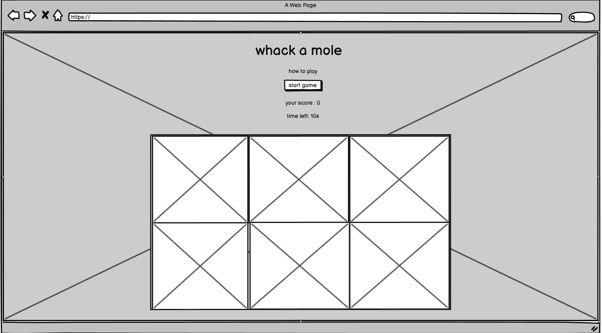

#  Whack a Mole 

### Whack a mole is a game in which players have 10 seconds to hit as many moles as possible.Players must react quickly and have good hand-eye coordination to succeed in this  game.

## *[Live site](https://karoskodev.github.io/Whack-a-Mole/)*
## *[Repository](https://github.com/Karoskodev/Whack-a-Mole)*

## contents

1. [ UX ](#ux)
2. [ Features ](#features)  
3. [ Technology used ](#technology)
4. [ Testing ](#testing)
5. [ Deployment](#deployment)
6. [ Credits](#credits)
7. [ Acknowledgements](#acknowledgements)

 

## UX
### Site Goals
Whack-a-Mole game has been designed to be fun and engaging for players of all ages and skill levels.
The game has been designed to be visually appealing and the screen is optimized for different screen sizes and resolutions, ensuring that it looks great on both desktop and mobile devices.

### Page Wireframe

  

## Features

### Start Button
 The game includes a "Start" button that users can click to begin playing the game, providing a clear and easy way to initiate the game.

 

 
Start button hovered on it:
 

### Scoring system
The game track and display the player's score. One mole hit = 1 point
 

### Time limit
The game has a built-in time limit of 10 seconds, providing a sense of urgency and challenge for players to whack as many moles as possible.
 

 
When the time runs out an alert pops up with the final score.
 

### Game field
The game includes a 3x2 grid of mole holes
 

### Randomized mole appearances
The moles appear in random  locations within the 3x2 grid, providing a dynamic and unpredictable gameplay experience for users.
 

### Alert with rules 
When the user clicks on the "How to Play"
  

 
an alert pops up with the rules of the game, providing users with a quick and easy way to understand the gameplay mechanics.

## Technology
 ### Languages Used
  1. HTML5
  2. CSS3
  3. Javascript ES6.
 ### Programs and others
 - Google Fonts - Gloria Hallelujah
 - GitHub as cloud repository
 - Midjurney for generating all images 

## Testing
Extensive testing was conducted to confirm that everything were functioning correctly.
To identify any potential issues, the site and documentation were reviewed by friends and family members.
Furthermore, the W3C Markup Validator, W3C CSS Validator and JShint Services were employed to scrutinize for any errors.
Also Lighthouse testing to evaluate performance for both the desktop and mobile versions.
 
### Google Lighthouse Testing
desktop:
 

 
mobile:
 

### HTML Validation

### CSS Validation

### JShint 

## Deployment

  To deploy the project, I followed these steps, beginning from the main project repository [here](https://github.com/Karoskodev/Whack-a-Mole)

1. Navigated to the Settings option in the repository's navigation menu.
2. Selected the Pages option on the sidebar.
3. In the first dropdown menu labeled Source, I chose the main branch from the available options.
4. Left the next dropdown labeled /root as the default option.
5. Selected the Save button.
6. Received a notification from GitHub indicating that the project was being deployed.
